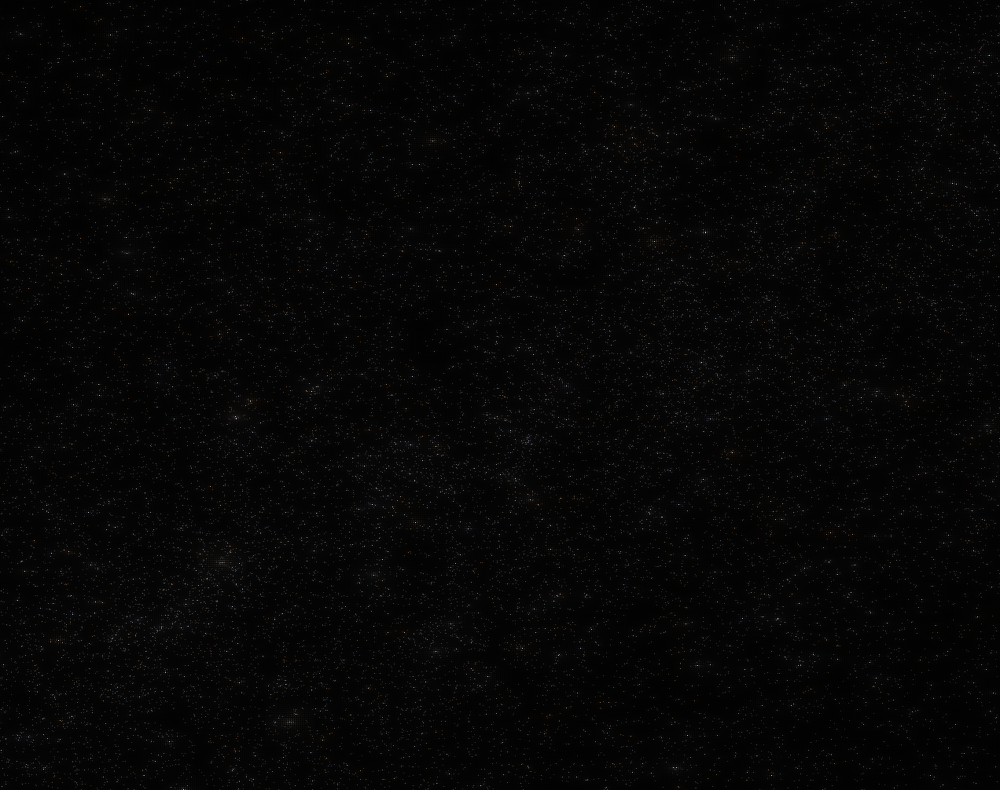

This project aims to realistically render a star-filled sky with Rust and OpenGL, using star catalogs and physically-based techniques. Currently, it uses the [Tycho-2 catalog](https://cdsarc.cds.unistra.fr/viz-bin/cat/I/259#/browse) for star positions. The rendering is done in two passes: the first to render the stars onto a 32-bit floating point framebuffer with the correct color (estimated from their blackbody temperature calculated from their B-V color) and brightness, and the second to apply "veiling luminance" (a convolution function which emulates light scatter within the eye), tonemapping that emulates human scotopic vision, and gamma correction.

The mouse controls the camera, spacebar toggles a debug outline of Ursa Minor, and escape closes the program.

This project is under development, and subject to change.

The mappings from star B and V intensities to color and brightness come from ["A Physically-Based Night Sky Model" (Jensen et al., 2001)](http://graphics.ucsd.edu/~henrik/papers/nightsky/nightsky.pdf).

Functions for scotopic vision and veiling luminance come from ["A Visibility Matching Tone Reproduction
Operator for High Dynamic Range Scenes" (Larson et al., 1997)](https://graphics.cs.yale.edu/sites/default/files/1997tvcg_hdr_tonemapping.pdf)